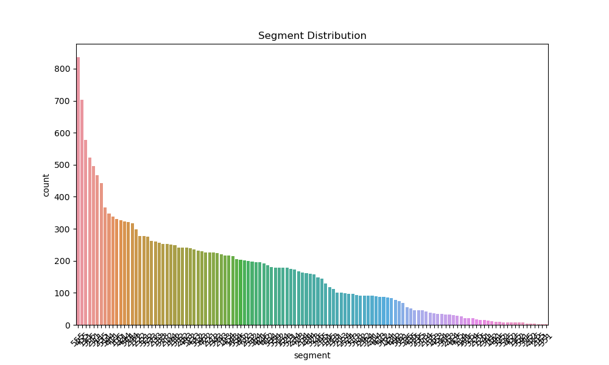

# FLO RFM Analysis Report

## About the Project

This project was conducted to perform customer segmentation and RFM (Recency, Frequency, Monetary) analysis for the FLO company. The analysis will help the company better understand customer behavior and develop targeted marketing strategies.

## Data Set Examination

Before starting the analysis, a thorough examination of the dataset was performed. Below are the general characteristics of the dataset:

### Dataset Size
The dataset size: {{ obs_count }} rows and {{ var_count }} columns

### Columns
The columns in the dataset are listed as follows:
{{ data_columns }}

### First 10 Rows of the Dataset
{{ data_head | safe }}

---

### Last 10 Rows of the Dataset  
{{ data_tail | safe }}

---

### Data Types
The data types of the columns are as follows:
{{ data_types }}

---

### Categorical Columns
The categorical columns in the dataset are:
{{ categorical_columns }}

---

### Numerical Columns
The numerical columns in the dataset are:
{{ numerical_columns }}

---

### Descriptive Statistics
Descriptive statistics of the numerical variables were examined:
{{ describe_data }}

---

### Missing Data Analysis
The dataset was examined for missing values, and there are
{{ missing_data }} 
missing values. This analysis helped identify which columns needed attention during the data cleaning process.

### Dataset Information
The data types and the number of non-null values for each column were analyzed:
{{ data_info }}

---

## Data Preparation and RFM Metrics

After examining the dataset, the necessary metrics for RFM analysis were calculated:

- Recency (R): The number of days since the customer's last purchase
- Frequency (F): The total number of orders placed by the customer
- Monetary (M): The total amount spent by the customer

Using these metrics, RFM scores were created for each customer, and customers were segmented into different groups.

## Channel Performance Analysis

The graph above shows the performance of various sales channels. Each channel's performance can be compared in terms of the number of customers, total orders, and total revenue.

## RFM Score Distribution

This histogram displays the distribution of customers' RFM scores. Areas where the scores are concentrated offer insights into general customer behavior patterns.

## Segment Distribution

This graph illustrates how customers are distributed across various segments. The size of each segment provides information about the structure of the company's customer base.

## Correlation Matrix

The correlation matrix highlights the relationships between the RFM metrics, helping to understand which metrics are more closely related to one another.

## Customer Behavior Analysis

This scatter plot shows the Recency and Monetary values of customers. Different colors represent different segments, helping to visualize customer behavior patterns.

## RFM Segmentation Results

This graph illustrates the results of the RFM segmentation in terms of Recency and Frequency. Each point represents a customer, and the color indicates their segment.

## Conclusion and Recommendations

As a result of the RFM analysis, customers have been divided into various segments. This segmentation will allow for more personalized marketing strategies and the development of specific approaches for each customer group.

Recommendations:
1. Loyalty programs can be designed for customers in the "Champions" segment.
2. Special campaigns can be organized for "At Risk" customers.
3. Personalized offers can be provided to retain "Can't Lose" customers.
4. Product variety can be increased, and cross-selling strategies can be applied for the "New Customers" segment.

Repeating this analysis regularly and continuously evaluating the results will contribute to the improvement of customer relationship management strategies.

---